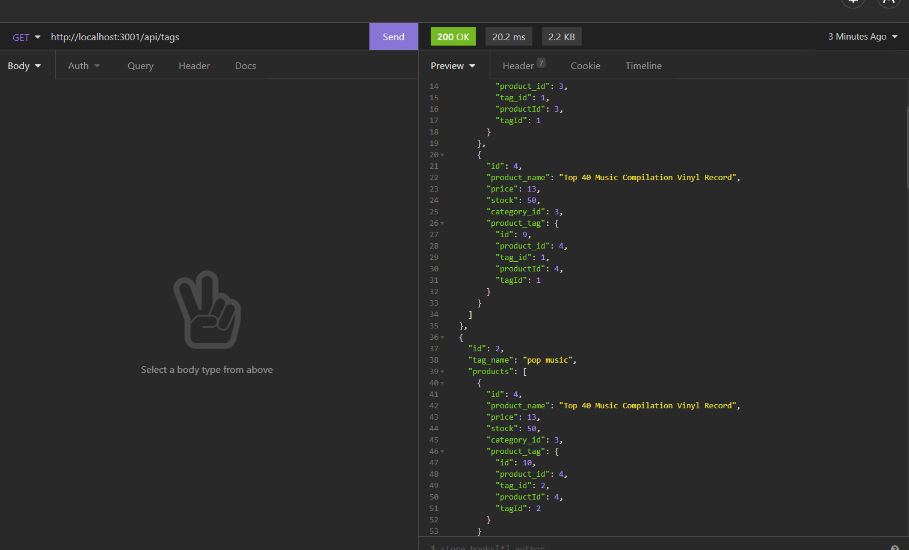

# E-Commerce-Backend

  [Project Repo](https://github.com/Cleggatron/E-Commerce-Backend)
  
  

  ## Description

  This is an exercise in using an ORM to handle our SQL queries. We also got to practise our Express routing for a real world use case of an ECommerce store.

  ## Table Of Contents

  - [Installation](#installation)
  - [Usage](#usage)
  - [Credits](#credits)
  - [License](#license)
  - [Questions](#questions)

  ## Installation

  Once the repo has been cloned to your machine wou will need to run `npm i` to install our dependencies. You will then need to create a .env file with fields for DB_USER=root, DB_NAME=ecommerce_db, and DB_PW="Your MYSQL password here". !!IMPORTANT!! Make sure that the .env file is included in your gitignore

  ## Usage

  [Video Link](https://drive.google.com/file/d/1RDzMAw0WVbzjUyQe15lQQSfOtb6zd6fR/view?usp=sharing)

  

  

  

  First you will need to set up the mysql database. run `mysql -u root -p` and then input your password. Once done run `source ./db/schema.sql` to initialise the database. Once done exit the mysql terminal, and in the GIT terminal run `npm run seed` to create the seed data for our database. Finally run `npm start` to get our server running.

  ## Credits

  Other Contributors: 
  N/A

  Third Party Technologies:
  Express, DotEnv, Sequelize

  ## License
  MIT License

  [License Link](https://opensource.org/licenses/MIT)

  Copyright <2021> <DavidClegg>

      Permission is hereby granted, free of charge, to any person obtaining a copy of this software and associated documentation files (the "Software"), to deal in the Software without restriction, including without limitation the rights to use, copy, modify, merge, publish, distribute, sublicense, and/or sell copies of the Software, and to permit persons to whom the Software is furnished to do so, subject to the following conditions:
      
      The above copyright notice and this permission notice shall be included in all copies or substantial portions of the Software.
      
      THE SOFTWARE IS PROVIDED "AS IS", WITHOUT WARRANTY OF ANY KIND, EXPRESS OR IMPLIED, INCLUDING BUT NOT LIMITED TO THE WARRANTIES OF MERCHANTABILITY, FITNESS FOR A PARTICULAR PURPOSE AND NONINFRINGEMENT. IN NO EVENT SHALL THE AUTHORS OR COPYRIGHT HOLDERS BE LIABLE FOR ANY CLAIM, DAMAGES OR OTHER LIABILITY, WHETHER IN AN ACTION OF CONTRACT, TORT OR OTHERWISE, ARISING FROM, OUT OF OR IN CONNECTION WITH THE SOFTWARE OR THE USE OR OTHER DEALINGS IN THE SOFTWARE.  

  ## Questions

  If you have any questions you can contact me at the below email address:
  david.robert.clegg@gmail.com

  You can also find me at my Github:
  [Github Profile](https://github.com/Cleggatron)

